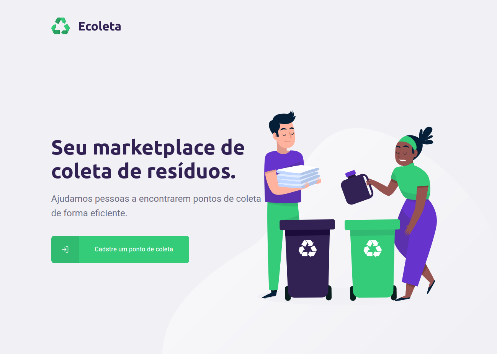

<h2 align="center"> Ecoleta</h2>
<h4 align="center">Application to help with waste collection and recycling by listing collection points </h4>
 

<h4>Web application screen:</h4>

 

  
  

 ### :computer: Languages and technologies:
  <ul style="list-style-type:circle;">
  <li>Typescript</li>
  </ul>
  Front-end<ul style="list-style-type:disc;">
  <li>React.js</li>
  </ul> 
  Back-end/API<ul style="list-style-type:disc;">
  <li>Node.js</li>  
  <li>Database:
  SQLite3</li>
  </ul>
  Mobile<ul style="list-style-type:disc;">
  <li>React Native</li>
  </ul>
  <h4>Some dependencies, libraries and resources used:</h4>
  back-end:
  <ul style="list-style-type:disc;">
  <li>express - server framework for NodeJS;</li>
  <li>knex - a SQL query builder for JavaScript;</li>
  <li>cors - a mechanism to restrict web URLs that can access the API;</li>
  <li>multer - for file uploads; </li>
  <li>celebrate - an express middleware function that wraps the Joi validation library; </li>
  </ul>
  front-end:
  <ul style="list-style-type:disc;">
  <li>axios - Promise based HTTP client for the browser and node.js;</li>
  <li>leaflet - an open-source JavaScript library for mobile-friendly interactive maps;</li>
  <li>react-dropzone - for file uploads</li>
  <li>react-icons - for icons 🤷‍♂️;</li>
  <li>react-router-dom - DOM bindings for React Router; </li>
  <li>yup - for validations; </li>
  </ul>
  mobile:
  <ul style="list-style-type:disc;">
  <li>expo - free and open-source platform for making universal native apps with React that run on Android, iOS, and the web.;</li>
  <li>axios - Promise based HTTP client for the browser and node.js;</li>
  <li>react-native-gesture-handler - for beautiful rectangular buttons</li>
  <li>react-native-maps - for map view 🤷‍♂️;</li>
  <li>react-native-picker-select - for select pickers; </li>
  </ul>

### :memo: License
  This project is under MIT license. Check [LICENSE](LICENSE.md) for details.
 
<small>
  Built at the Next Level Week #1 event, by :rocket: [RocketSeat](https://rocketseat.com.br/), instructed by [Diego Fernandes](https://github.com/diego3g)
  </small>
